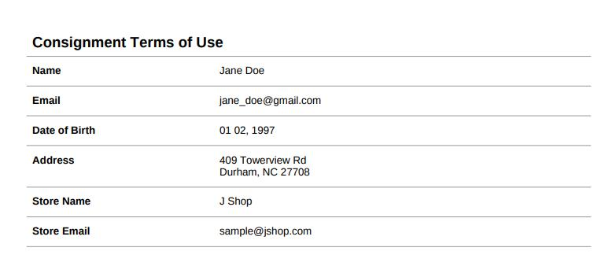
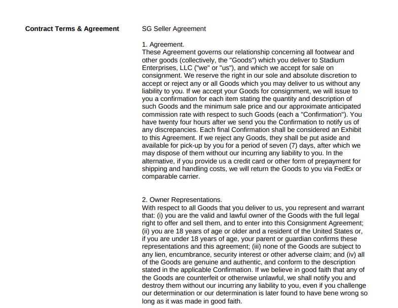
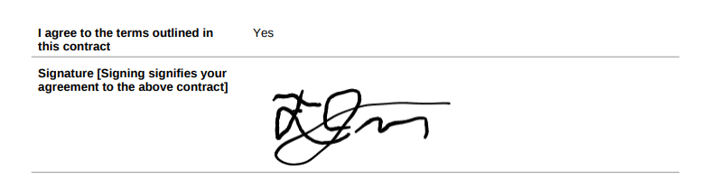

# PDF Contract Generator
This is a website which allows users to input contact information/signature to generate a templated PDF contract. Harnessing the JSPDF library, it uses pure Javascript to generate professional, customizable PDF contracts.

## Usage
Form inputs fields for the contract can be added or deleted as needed from /index.html. Make sure that the class name is inp and that the name and id selectors match. Javascript will automatically take all input fields and generate corresponding lines in the output PDF.
```HTML
<p> First Name </p>
<input class="inp" name = "first_name" type="text" id = "first_name">
```

To add new pages with custom terms and services text, specify a variable to hold the text and append it to the pages array.
```javascript
var page1 = "1. Agreement. These Agreement governs our relationship concerning...";
var pages = [page2];
```

Contract styling can be changed in /scripts/index.js as per JSPDF documentation.

## Examples
Here are screenshots of a sample PDF contract for a shoe consignment store which was generated using this application.



